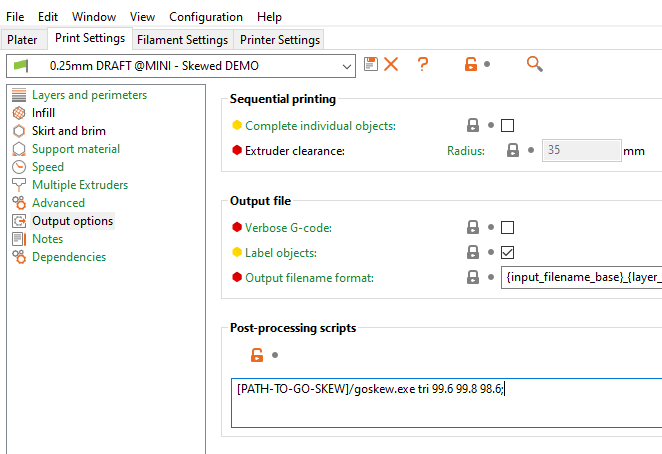

# GoSkew

GoSkew is a program for post-processing G-code to account for axis skew. The
method and techniques are heavily based on
[gSkewer](https://github.com/MechanizedMedic/gskewer), a python script with a
similar purpose.

I have personally found the method of measuring the error outlined by
[gSkewer](https://github.com/MechanizedMedic/gskewer) quite fiddly and prone to
inaccuracy. For that reason, at least for XY skew, I am working on a new method
of calculating error that requires only a printed object and calipers.

# Installation

Pre-compiled binaries for 64bit Windows, Linux, and OSX, can be found in [releases](https://github.com/Kranex/goskew/releases).
Just grab the one you need and run it directly on the command line.

If a release is not available for your system, or you just want to build it yourself, this can be done in one of two ways.
First of all you will need to [install Go](https://golang.org/doc/install) and make sure that it is added to your system path.

Then you can run:

```
$ go install github.com/olistrik/goskew
$ goskew --help
```

Which will fetch and build this repo and add it to your `GOPATH`. It can then be executed from anywhere like a normal command.

Or you can clone and build the repo manually:

```
$ git clone https://github.com/Kranex/goskew.git
$ cd goskew
$ go build .
$ ./goskew --help
```

# Skew Calculation

## Using [olistrik.github.io/skew-it](https://olistrik.github.io/skew-it/)

[Skew It](https://olistrik.github.io/skew-it/) is an online calculator for calculating error tangent values using a test print.

1. Print the Skew It test print. The larger the better but keep in mind you will need to be able to reliably measure the diagonals of the cube.
2. Measure the labeled diagonals in each plane you wish to calibrate. the cube has more labels than the calculator for future improvements.
3. Fill in the calculator, and use the resultant output in the command:

```
goskew err --xy=XYTAN --xz=XZTAN --yz=YZTAN
```


## Using the calitriangle.stl (Only for XY plane)
TODO: Explain how this works and add diagrams.

Print the caliangle calibration triangle found in docs. Make sure that a side is aligned to an axis, Perferably the X axis. You can print the triangle at whatever size you like, the bigger the better. 

Measure each of the sides using callipers or any other accurate method. The base is whichever side is aligned to an axis. You ideally want as many significant figures as possible.

For example, my calitriangle measured 99.69, 110.10, and 99.15.

The command can then be structured like this:

```
goskew tri 99.69 110.10 99.15 -o caliangle-skewed.gcode caliangle.gcode
```

Print the skewed gcode and measure the sides again. The triangle should now be equilateral or at least the left and right sides should be equal.

If all sides are equal, but not equal to 100mm, then you either need to apply some xy scaling in your slicer or up your extrusion
multiplier. If the left and right are equal but the base is not, then you need to scale the y axis (if the base is aligned to the x axis). Either way your printer is no longer skewed.

# Usage

> [!WARNING]
> GoSkew only supports skewing linear moves (G0 & G1). If your gcode contains arcs (G2 & G3), they will be left unskewed.
> If you know of a way to skew arcs, let me know.

Go Skew has two main commands:

```
# xy, xz, and yz are xytan, xztan, and yztan respectively, if you don't need one, put in 0.
# If you require a negative tan value, you can give it with the --xy=ERROR arguments to avoid the minus being read
# as a flag.
goskew err <xy> <xz> <yz> [--output=FILE] <file>

# base, left, and right are the lengths of the respective sides of the printed caliangle in milimeters.
# If file is left out, the xytan is calculated and printed. This can then be with the err command so that
# it doesn't need to be calculated every time.
goskew tri <base> <left> <right> [--xz=ERROR --yz=ERROR --output=FILE] [<file>]

```

If you already know the error in your axis, you can give xytan, xztan, and yztan with the `err` command.

Alternatively if you have followed my method using the caliangle calibration triangle, you can give the side lengths
of your printed caliangle with the `tri` command. the additional xz and yz errors cannot be calculated with a caliangle,
but can be given with the optional `--xz` and `--yz` arguments.
Both commands can be given an output file with `--output`, if not given Go Skew will overwrite the source file.

# Automatic skewing with Slic3r and PrusaSlicer

> [!NOTE] 
> In PrusaSlicer you will need to be in Expert mode.

> [!WARNING]
> Recient versions of PrusaSlicer have begun optimizing arcs and circles with G2/3 commands. GoSkew doesn't support these.
> You can disable this option under `Print Settings -> Advanced -> (Slicing) Arc fitting`.

> [!WARNING]
> Recient versions of PrusaSlicer have started exporting binary g-code if the target printer supports it. GoSkew doesn't support this. 
> You can disable this for a specific printer in `Printer Settings -> General -> (Firmware) Support binary G-code`
> You can disable it for all printers globally in `Configuration -> Preferences -> Other -> Use binary G-code when the printer supports it`.

First download or build Go Skew, then add the path to the binary and the arguments to Print Settings -> Output Options -> Post-processing scripts:



Common paths include:

```
# when installed on windows using go get/install
C:/Users/[USER]/go/bin/goskew.exe

# another windows install location 
"C:/Program Files/go/bin/goskew.exe"

# most *nix distributions
${HOME}/go/bin/goskew
```

Do not give the `--output` option, it is a requirement that scripts overwrite the source file.

# TODO

- ~Add docopt~
- ~Add skew code~
- ~Add and test triangle error measurement~
- Write an awesome readme
